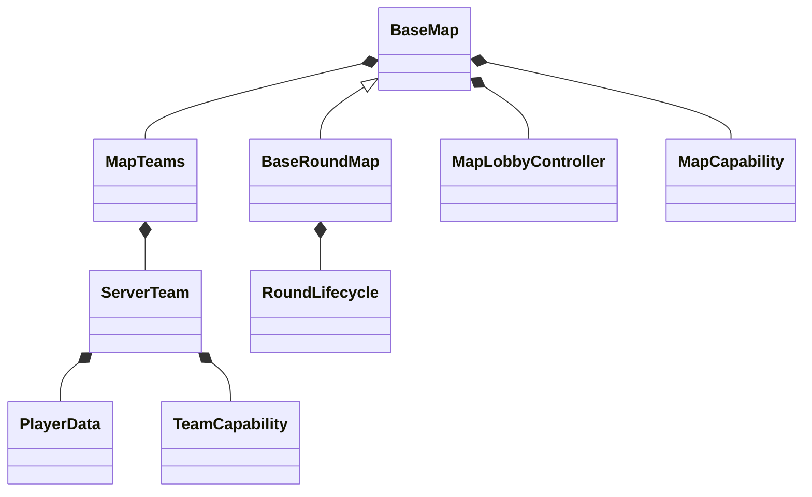

# 对象关系与状态归属

开发 FPSMatch 模式时，首先要区分注册定义和运行实例。`elimination` 是规则类型；`training` 是按该规则创建的一张地图；地图中正在进行的比赛和回合则是可重置的运行状态。

## 游戏类型不是地图单例

游戏类型注册表保存三参数工厂。创建两张竞技场时，它会产生两个地图对象，每个对象拥有自己的队伍、区域、设置和比分。

这里 `BaseRoundMap` 继承 `BaseMap`；它不是 BaseMap 内部的另一个地图对象。图中的能力由对应宿主的 `CapabilityMap` 容器管理。

## 一张地图可以运行多场比赛

地图区域与配置通常跨比赛保留。`start()` 启动一次比赛，`victory()` 发布结算，`reset()` 清理需要重新开始的状态。重置不应无条件重新注册类型，也不应把服务器所有竞技场的状态放在静态字段中。

队伍定义与队伍成员也不同。需要保留房间中的玩家继续下一场时，可以只重置分数和比赛状态；调用 `MapTeams.reset()` 会清空名单，不适合直接当作所有模式通用的回合重置。

## 每 tick 的驱动

框架通过 `BaseMap.mapTick()` 更新比赛时钟、检查整场胜利、调用地图 `tick()`，在未开始时更新大厅，然后处理队伍、能力和同步。`BaseRoundMap` 在自己的 `tick()` 中推进回合计时器。

因此，覆盖回合地图的 `tick()` 时需要调用父实现；不要从其他监听器再调用一次 `mapTick()`。计时器、队伍和能力已经有明确的驱动入口。

## 把状态放在哪里

| 数据 | 合适的位置 | 例子 |
| --- | --- | --- |
| 地图规则配置 | `Setting<T>` | 目标分、回合时长 |
| 整场临时状态 | 地图实例字段 | 本场目标分快照、是否等待结算 |
| 当前回合驱动 | `RoundLifecycle` | 阶段、经过时间、最后结果 |
| 规则输入快照 | `RoundContext` | 本 tick 双方存活数 |
| 参赛数据 | `PlayerData` | 击杀、死亡、存活、出生点 |
| 可复用宿主功能 | 地图或队伍能力 | 播报、套件、商店 |
| 独立长期数据 | `SaveHolder` | 赛季胜场 |
| 客户端显示 | S2C 快照及客户端模型 | 比分文本、房间状态 |

`RoundContext` 常在每 tick 重建，适合快照，不适合保存唯一的持久状态。网络包只传递显示值或玩家意图，不能成为服务器胜负的权威来源。

按这个对象关系开始实践：[连续教程](game-mode-tutorial.md)。
