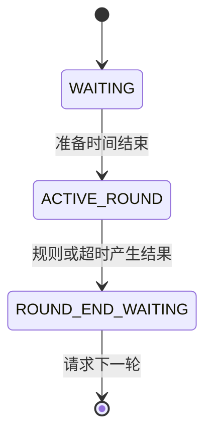

# 阶段回调与暂停

回合阶段定义哪些逻辑应在何时发生。`RoundLifecycle` 提供 `WAITING`、`ACTIVE_ROUND`、`ROUND_END_WAITING` 和 `PAUSED`。



## 放置回调

`onWaitingTick(context)` 适合准备倒计时。`onRoundStart()` 在进入战斗阶段时调用一次。`onRoundTick(context)` 在活动回合执行，随后评估结束规则。`onRoundEnd(result)` 只处理本轮结果，`onNextRoundRequested()` 决定下一轮或整场胜利。

使用地图的 `lifecycleBuilder()` 时这些回调已绑定。再次调用 Builder 的同名配置方法会替换回调，不会自动追加。

## 阶段时钟

`phaseElapsedTicks()` 描述当前阶段的经过时间，`roundElapsedTicks()` 描述活动回合时间。显示准备剩余时间时，不应使用只在活动回合增长的时钟。

`roundTicks()` 是配置的活动上限。当前实现先评估规则和超时，再推进活动计数，因此不要把它解释为独立于服务器 tick 的精确墙上时间。

## 暂停计时器

在回合地图内部，可以封装暂停入口：

```java
public void setRoundPaused(boolean paused) {
    if (isStart() && roundLifecycle != null) {
        roundLifecycle.setPaused(paused);
    }
}
```

暂停会记录原阶段，进入 `PAUSED` 并停止计时器推进；恢复时回到原阶段。命令或网络请求应在服务器线程通过地图方法调用它。

## 暂停与游戏规则

暂停计时器不会自动冻结玩家、取消伤害或停止地图能力 tick。需要完整战术暂停时，让伤害、移动和购买规则查询暂停状态，再决定是否接受操作。

`shouldAdvanceRoundLifecycle()` 是另一个扩展点：返回 `false` 可临时阻止地图推进计时器，但不会自动把 `phase()` 改成 `PAUSED`。HUD 需要显示暂停时，应明确选择哪一层状态作为展示来源。
