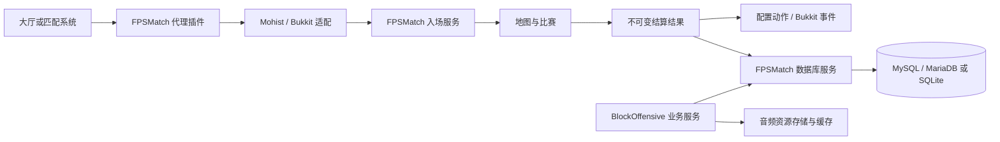

# FPSMatch 服务端联动与持久化设计

日期：2026-09-15。状态：设计稿，尚未实现。

已确认：先设计方案和接口，再分阶段实现；数据库支持 MySQL/MariaDB 跨服共享，并提供 SQLite 单服模式。接口和配置示例是拟定契约，不是当前可调用 API。

## 1. 目标与职责

玩家通过 BungeeCord/Waterfall 转入游戏服时，FPSMatch 接收可信的入服上下文，自动加入指定地图和队伍。比赛结算后，服主可配置胜利、失败、平局等动作，包括执行 Bukkit 插件指令。FPSMatch 同时提供通用数据库能力，供 BlockOffensive 的 MVP 音乐选择、个人商店配置、玩家仓库使用。

| 组件 | 职责 |
| --- | --- |
| FPSMatch 核心 | 入场服务、比赛结果快照、动作调度、数据库生命周期、事务、迁移、数据类型注册 |
| FPSMatch Mohist/Bukkit 适配 | Bukkit 插件身份、消息通道、Bukkit 事件、控制台指令、服务发现 |
| FPSMatch 代理插件 | 接收大厅/匹配系统的转服请求，生成入服票据、传输上下文、处理回执 |
| BlockOffensive | CS 胜负规则、音乐装备规则、商店合法选项、仓库物品语义、界面和客户端同步 |
| 管理员配置 | 子服标识、数据库连接、可信代理、可用结算动作和模板 |

数据库核心不依赖 Bukkit；纯 Forge 也能使用数据库和原生命令。第一版代理传输以 BungeeCord/Waterfall + Mohist 1.20.1 为验收组合。Velocity、其他混合端、纯 Forge 的代理消息接入是后续适配，不承诺第一版直接兼容。



## 2. 当前代码与接入位置

以下路径相对 FPSMatch 仓库；`../src` 指 BlockOffensive。

| 现状 | 设计影响 |
| --- | --- |
| `src/main/java/com/ptcrys/fpsmatch/bukkit/FPSMBukkit.java` 只检测 Bukkit 类并注册事件桥接 | 需要单独识别 Mohist，并分离“类存在”“Bukkit 已启动”“服务可用”三个状态 |
| `bukkit/plugin/BukkitFPSMatch.java` 是空的 JavaPlugin 子类 | 尚无插件注册、启停和消息通道生命周期 |
| `core/FPSMCore.java` 在 ServerStartedEvent 创建核心、注册并读取地图 | Bukkit 插件启动时 FPSMatch 地图可能尚未就绪；必须有 readiness 状态 |
| `common/mapselect/MapRoomActionService.java` 与 `core/map/BaseMap.java` 已有入场链路 | 在此抽取公共入场服务，代理不能绕过地图规则直接修改队伍集合 |
| `BaseMap.join` 先退出原队，再调用目标队伍检查 | 自动入队前须预检；实施时修正失败导致原队丢失的顺序问题，并处理事件取消 |
| `common/event/FPSMapEvent.java` 的 VictoryEvent 已捕获比分，但无明确获胜方和比赛 ID | 新增通用结算快照；不能简单把最高分认定为获胜者 |
| `bukkit/event/BukkitGameWinnerEvent.java` 只持有实时地图和世界 | 增加携带不可变结果的新事件，异步保存不再读取已重置地图 |
| `core/persistence/FPSMDataManager.java` 是文件持久化 | 将其升级为唯一数据门面；保留地图、预设等文件能力，并在同一生命周期下提供 SQL 文档、事务和迁移；不让业务各自创建第二套数据库管理器 |
| `../src/main/java/com/ptcrys/blockoffensive/server/mvp/MvpMusicServerStore.java` 按 UUID 保存本地 OGG 和名称 | 需要迁移音乐元数据，并另行解决跨服音频文件可用性 |
| `../src/main/java/com/ptcrys/blockoffensive/map/CSGameMap.java` 正常胜利后立即 reset，部分平局路径直接 reset | 在重置之前统一结算出口，覆盖平局、终止、正常结束；避免遗漏或重复 |

## 3. Mohist 中的 Bukkit 插件身份

用户安装体验：游戏服只需安装 FPSMatch 模组；开启 Mohist 适配后，自动提供名为 `FPSMatch` 的 Bukkit 插件。代理服仍需安装独立代理插件，因为游戏服模组无法在代理进程中执行。

建议优先验证“模组内置独立的小型 Bukkit 桥接 JAR”：桥接入口使用独立包名，仅包含插件入口和适配代码，不把完整 FPSMatch 再加载一次。在 Bukkit 扫描插件前准备桥接文件，让正常 PluginClassLoader 加载它。文件版本、来源标记与内容哈希由模组管理；同名第三方文件不覆盖，冲突时明确报错。

这个方案优先保证 `depend: [FPSMatch]`、`/plugins`、标准启停和 Bukkit 服务管理器的行为。必须在实际 Mohist 版本中验证：扫描前可用挂接点、插件类加载器访问 Forge 服务的方式、API 类身份一致性。独立桥接入口不能被 Forge 提前加载；共享 API 不得在两个类加载器中重复定义。桥接通过已验证的服务解析入口访问模组服务，数据库及地图实例只归模组所有。

若正常扫描方案无法实现，再评估自定义 PluginLoader 注册插件对象；该备选方案需要独立解决依赖扫描，不把“加入插件列表”当作支持硬依赖。禁止直接使用当前空类的默认构造器实例化：Mohist JavaPlugin 默认构造器和 JavaPluginLoader.enablePlugin 都依赖 PluginClassLoader。

生命周期：插件 onEnable 注册消息接收器、Bukkit 服务入口；核心返回 STARTING，地图和必要数据库就绪后转 READY。插件可提前被其他插件发现，但业务调用必须检查 readiness。onDisable 取消 Bukkit 监听和调度任务，停止接收入服请求；模组停服负责关闭数据库。禁用插件不会卸载 Forge 模组。首版不支持热卸载或插件重载工具。

参考核对范围：Mohist 1.20.1 分支的 [JavaPlugin](https://github.com/MohistMC/Mohist/blob/1.20.1/src/main/java/org/bukkit/plugin/java/JavaPlugin.java)、[JavaPluginLoader](https://github.com/MohistMC/Mohist/blob/1.20.1/src/main/java/org/bukkit/plugin/java/JavaPluginLoader.java)、[SimplePluginManager](https://github.com/MohistMC/Mohist/blob/1.20.1/src/main/java/org/bukkit/plugin/SimplePluginManager.java)。分支可能变化，实施时锁定验收构建及源码提交。

## 4. 代理入服上下文

### 4.1 统一的 FPSMatch 跨服 Message

新增 `FPSMatchMessage` 消息协议与 `FPSMatchMessaging` 服务，统一支持代理与子服、子服与子服之间的通信。自动入队只是其中一种请求；比赛结果通知、房间状态查询和玩家配置失效通知复用同一套编解码、路由、身份验证与回执机制。它是服务端之间的接口，与现有客户端 SimpleChannel 包注册分开。

消息 API 与传输实现分开，业务不直接操作 Bukkit Messenger 或 Redis 客户端。首版先实现 Plugin Messaging 传输，再按需要增加不依赖玩家连接的传输。

| 传输 | 适用范围 | 明确限制 |
| --- | --- | --- |
| `PLUGIN_MESSAGE` | 首版 BungeeCord/Waterfall ↔ Mohist，通过代理转发给其他子服 | 依赖玩家连接；空服无法立即通信，有限等待或返回 NO_ROUTE |
| `REDIS_STREAMS`（后续可选） | 持续通信、空服房间查询、纯 Forge 服务端间消息 | 需要独立 Redis 部署、消费确认、重试与保留策略；并非只写入 Stream 就完成处理 |
| `LOCAL` | 单服调试和契约测试 | 不提供跨进程通信 |

Redis Pub/Sub 可用于允许丢失的刷新提示，不作为可靠入队/奖励请求的默认实现。MySQL/MariaDB 负责持久化，不默认承担实时消息轮询。若要求首版就能给空服发送并获得响应，需将 Redis Streams 传输提前到入服联动阶段；单靠插件消息不能满足。

拟定信封：

```java
record FPSMatchMessage(
    int protocolVersion, UUID messageId, UUID correlationId,
    String networkId, String sourceNode, String targetNode,
    MessageKind kind, String type, int payloadVersion,
    Instant sentAt, Instant expiresAt, byte[] payload) {}
```

`kind` 为 REQUEST、RESPONSE、EVENT；type 使用 `fpsmatch:join_match`、`blockoffensive:profile_changed` 等命名空间。sourceNode/targetNode 区分 `proxy:main`、`server:cs-01`。correlationId 在 RESPONSE 中指向原 REQUEST 的 messageId，其他消息为空。实际 DTO 必须防御性复制字节数组。线上帧还包含 keyId 和签名，覆盖完整信封及载荷。

sourceNode 由本地服务填入且与已认证连接/密钥身份匹配，不能信任发送者任意填写的来源。networkId 防止不同服组消息串用；过期消息直接拒绝。消息级 schema 与协议版本独立演进；未知消息类型或版本返回结构化错误，不反射实例化任意 Java 类。

代理转发保留原 messageId、来源身份和目标，回执反向路由；首版只允许单次代理中转，不自动在节点之间再次转发。共享密钥意味着同组节点互相信任；需要限制某子服不能伪装代理时使用节点独立密钥或签名，并由路由层校验类型权限。JOIN_MATCH 只允许已授权代理/匹配服务发起，普通子服的状态通知不能转成管理员操作。

接口草案：

```java
interface FPSMatchMessaging {
    <Q, R> CompletionStage<R> request(
        NodeId target, RequestType<Q, R> type, Q payload, Duration timeout);
    <E> CompletionStage<DeliveryReceipt> send(
        NodeId target, EventType<E> type, E payload);
    <Q, R> Subscription handle(
        RequestType<Q, R> type, RequestHandler<Q, R> handler);
    <E> Subscription listen(EventType<E> type, MessageListener<E> listener);
}
```

RequestType/EventType 在初始化时注册 codec、载荷上限、允许来源和执行线程策略；RequestHandler 接收已认证 MessageContext 及解码后的载荷。代理可依赖一个不包含 Minecraft/Forge/Bukkit 类型的协议/API 模块。BO 扩展消息通过注册自己的类型实现，不修改 FPSMatch 传输实现。

`request` 的完成表示收到业务响应，入队请求应返回最终 AdmissionResult；传输 ACK 只说明接收，不说明入队完成。`send` 的 DeliveryReceipt 仅报告传输交付状态，不表示监听器业务完成。需要确认处理的操作必须使用 request。首版点对点发送；以后广播返回每个目标的交付结果，不以一个成功回执表示全服成功。

执行与可靠性契约：

- 入站先验证身份、大小、协议、有效期和限流，再派发 handler。网络线程不直接访问地图；地图类 handler 显式调度至服务器线程，数据库仍使用数据库执行器。
- 每节点有界出入队列、最大在途请求数和超时；无路由返回 NO_ROUTE，不无限排队。玩家只作为 Plugin Messaging 载体，必须另外绑定业务玩家/连接会话，不能将载体 UUID 当作目标玩家 UUID。
- 重试使用相同 messageId；业务操作另带 transferId、matchId 或 operationId。不同 messageId 仍可能指向同一业务操作，所以持久副作用依靠业务层幂等，不只依靠消息缓存。
- 不承诺全局有序和恰好一次。重连可能重复、乱序；档案变更带 revision，接收者不能应用更旧版本。响应校验 correlationId、消息类型和预期来源，迟到回执不匹配到其他请求。
- 超时表示结果未知，不保证未执行，也不隐含远端取消。提供业务查询/同幂等键重试，不生成新操作 ID 再发奖励。进程重启后，重要请求由持久业务记录恢复；内存回执缓存只用于短期去重。
- 若必须保证数据库提交后最终发出消息，结果与 outbox 记录同事务提交，再由后台投递并标记完成；消费者仍按业务键去重。普通缓存失效通知可丢失，通过 TTL/revision 复查修复。
- 音频、完整仓库和大文件不经 Message 传输；只发送资源 ID、内容哈希、revision 和受约束的小型业务载荷。

首批消息契约：

| 类型 | 模式 | 载荷或结果 |
| --- | --- | --- |
| `fpsmatch:session_hello` | 请求/响应 | 当前连接 challenge → 签名入服票据或无待办；代理也可在握手后投递 join_match |
| `fpsmatch:join_match` | 请求/响应 | 入服票据 → AdmissionResult |
| `fpsmatch:transfer_status` | 请求/响应 | transferId → 已知状态或 UNKNOWN |
| `fpsmatch:query_rooms` | 请求/响应 | 筛选与分页 → 房间 ID、状态、人数和采样时间 |
| `fpsmatch:match_finished` | 事件 | matchId、结果摘要、结果是否已持久化；通知不等同于发奖授权 |
| `blockoffensive:profile_changed` | 事件 | UUID、数据 key、revision；接收者失效缓存并按需读库 |

示例：大厅通过代理请求 cs-01 自动安排某玩家进入指定队伍，使用 `request(cs01, JOIN_MATCH, ticket, timeout)`；cs-01 调用 AdmissionService，返回 JOINED/TEAM_FULL 等结果。比赛结束后，cs-01 向大厅发送 MATCH_FINISHED，大厅更新界面；仓库奖励由结算事务服务处理，不靠每个大厅收到广播就分别发奖。

### 4.2 入服票据与消息流程

“携带信息”使用上述 Message 协议，不依赖客户端自行上报，不把任意字段塞进标准 BungeeCord 身份转发数据。BungeeCord 标准转发不自动提供这些业务字段。

统一 Plugin Messaging 通道定为 `fpsmatch:message`，替代早期草案的 `fpsmatch:transfer`；入服票据放在 `fpsmatch:join_match` 的载荷中。载荷保留独立签名，代理转发时也能校验原签发者。Plugin Messaging 依赖已连接玩家，不能假定目标空服在玩家连接前能够收到消息。因此默认流程是：

1. 大厅/匹配系统调用代理侧 `transfer`，指定玩家、目标子服、地图、队伍等。
2. 代理生成 transferId，在自身保存待交付上下文，然后切换玩家到目标服。
3. 目标服为本次玩家连接生成随机 sessionId，向代理发送 HELLO；代理确认消息来自该玩家当前目标服后，绑定 sessionId 签发并发送短期票据。目标 FPSMatch 未 READY 时保持有界等待。
4. 后端收到消息与玩家登录可以先后发生，按 UUID、连接会话和 transferId 会合；断线、换服立即失效旧会话。
5. 校验票据后加载必要玩家档案；回服务器线程调用统一入场服务。
6. 后端返回 `APPLIED` 或明确拒绝原因；代理按同一 transferId 有限重试，收到最终回执后清除上下文。

协议字段建议如下，签名覆盖除 signature 外的完整确定性编码，包括所有业务字段：

```json
{
  "protocol": 1,
  "transferId": "<UUID>",
  "playerId": "<UUID>",
  "sessionId": "<目标连接会话标识>",
  "issuer": "proxy-main",
  "targetServer": "cs-01",
  "issuedAt": 0,
  "expiresAt": 0,
  "keyId": "proxy-key-1",
  "action": "JOIN_MATCH",
  "gameType": "cs",
  "mapId": "dust2-room-1",
  "matchId": "<可选：指定比赛实例 UUID>",
  "teamId": "ct",
  "partyId": "<可选>",
  "extensions": {},
  "signature": "<HMAC-SHA256>"
}
```

约束：

- ticket 默认有效期建议 30 秒、正文上限 8 KiB；限制字符串长度、扩展字段大小和每玩家待处理数。HMAC 使用固定版本的确定性编码或原始签名字节，不能重排 JSON 后验证。
- 只接受已配置代理身份和目标 serverId；UUID 必须对应当前连接玩家。共享密钥仅留在代理和服务器，提供 keyId 轮换。后端网络限制代理访问，并使用代理正确转发的 UUID，跨服不能混用不同 UUID 规则。
- 同一 transferId 的相同载荷返回已知结果；不同载荷冲突拒绝。sessionId 由后端为连接生成并保存在内存，不能采用消息自报值替换；重复票据不能在新登录会话重新生效。进程重启后的旧票据也必须通过新会话校验，不依赖易失内存缓存防重放。
- HELLO、最终回执同样进行来源、会话和签名校验；代理检查发送者是当前目标后端连接，不能把客户端同名通道消息当成后端回执。握手和业务处理均支持有限重试，票据消费记录至少保留至票据过期加时钟容差。
- `extensions` 按命名空间注册类型，未知字段不执行动作；代理票据不能包含任意控制台指令。
- 入场检查：核心 READY、地图存在、比赛实例匹配、队伍合法且有容量、允许中途加入、业务权限和可取消事件通过。已在目标队伍则返回成功而不重复进出。
- 明确错误码：`NOT_READY`、`EXPIRED`、`INVALID_TICKET`、`SESSION_CHANGED`、`MAP_NOT_FOUND`、`MATCH_CHANGED`、`TEAM_FULL`、`TEAM_NOT_FOUND`、`JOIN_DENIED`、`PROFILE_UNAVAILABLE`。不得失败后自动加入随机比赛。
- 超时默认留在安全大厅状态并通知代理；是否退回大厅由代理配置。回执丢失造成的超时不得被描述为“确定未入队”，可先查询处理结果。
- 票据本身不预留位置。小队需要保证同时入场时，后续增加有过期时间的席位预留协议；首版逐人返回结果，不承诺整队原子转服。

接口草案：

```java
// 代理侧；调用方是大厅/匹配插件。
interface ProxyTransferService {
    CompletionStage<TransferResult> transfer(UUID player, TransferTarget target);
}

// 核心服务；适配层校验签名后产生不可由客户端直接提交的上下文。
interface AdmissionService {
    CompletionStage<AdmissionResult> admit(VerifiedJoinContext context);
    Optional<AdmissionReceipt> receipt(UUID transferId);
}
```

admit 可从适配线程调用，但地图操作只能在服务器线程执行。异步档案返回时重新检查在线状态、连接会话和地图实例。实现时复用并整理 `MapRoomActionService → BaseMap.join`，不要仅调用 `MapTeams.joinTeam`。目标队伍预检与提交在同一服务器任务中完成；原队退出被取消时终止迁移，不能造成同时在两张地图。其他入口逐步复用相同服务。

## 5. 比赛结果与结算动作

新增唯一 matchId，每次新比赛重新生成；多回合比赛共享 matchId，以 roundIndex 区分回合。地图名称不承担实例 ID 的职责。CS 换边时 ct/t 是阵营，未必是稳定参赛队伍身份，结果应保存参赛队伍 ID、结束时阵营及每玩家明确结果。

由玩法提供结算结果：CS、死斗等分别实现结果构造，不在 FPSMatch 根据分数猜胜负。覆盖 WIN、LOSS、DRAW、ABORTED、UNRANKED；旁观者不自动获得参赛奖励。离线玩家、提前离场玩家是否具有奖励资格由玩法生成结果时确定。

```java
record MatchResult(
    UUID matchId, String serverId, String gameType, String mapId,
    Instant startedAt, Instant endedAt, String endReason,
    List<TeamResult> teams, List<PlayerResult> players) {}

record PlayerResult(UUID playerId, String playerName, String participantTeamId,
                    Outcome outcome, boolean rewardEligible, ScoreSnapshot score) {}

interface MatchSettlementService {
    CompletionStage<SettlementReceipt> submit(MatchResult immutableResult);
}
```

结果内部只保存不可变值，不包含 ServerPlayer、BaseMap、World、可变 ItemStack 等引用。列表防御性复制。服务器线程在 reset/清理前捕获结果并发出 Forge `MatchFinishedEvent` 和 Bukkit `FPSMatchFinishedEvent`；落库完成后另发 `MatchSettlementCommittedEvent`。这两个时点不得混淆。旧 VictoryEvent/BukkitGameWinnerEvent 保留兼容期，内置动作只订阅一个新入口。

配置示例采用 JSON；初版复用现有 JSON 能力，无须为了配置引入 Bukkit 依赖。以下是目标格式：

```json
{
  "rules": [
    {
      "id": "cs-win-message",
      "trigger": "MATCH_FINISHED",
      "gameTypes": ["cs"],
      "outcomes": ["WIN"],
      "audience": "EACH_ELIGIBLE_PLAYER",
      "actions": [
        {
          "id": "notify",
          "type": "CONSOLE_COMMAND",
          "dispatcher": "BUKKIT",
          "template": "tell {player} 你赢得了本场比赛！",
          "offlinePolicy": "SKIP"
        }
      ]
    }
  ]
}
```

支持 `MATCH_FINISHED`、以后增加独立 `ROUND_FINISHED`；规则可按地图、玩法、胜负筛选，区分每场一次和每玩家一次。明确选择 FORGE 或 BUKKIT 指令分派器，不使用可能重复执行的双重尝试。所有命令都在服务器线程运行，模板来自本地管理员配置；内置占位符白名单、类型校验，名字使用服务器确认的账户名，不把显示名、票据扩展或客户端文本当命令片段。第一版不依赖 PlaceholderAPI。

去重键包含 matchId、ruleId、actionId、目标玩家（或比赛级目标）以及规则版本。配置在结果提交时固定版本，避免重载使已完成动作重新执行。失败可以查询原因。

必须区分两类效果：

- FPSMatch/BO 仓库奖励：奖励流水与资产变更同数据库事务提交，业务幂等键保证重试不重复发放。
- 任意 Bukkit 命令：数据库与外部插件无法通用地原子提交。普通通知可只保证运行期去重；涉及经济的命令不得宣称崩溃后恰好执行一次。持久任务执行前置为 RUNNING，崩溃后未知结果转 UNKNOWN，默认不盲目重试。需要可靠奖励时接入支持业务幂等键的插件 API，或使用 FPSMatch 事务奖励接口。

## 6. 数据库层

### 6.1 与现有 FPSMDataManager 合并

新的数据库设计应与现有 `FPSMDataManager` 合并，而不是新增平行的 `DatabaseManager`。`FPSMDataManager` 成为 FPSMatch 唯一的数据入口和生命周期所有者，负责初始化、模块注册、迁移、读写调度、停服排空和错误状态。实现上可以拆出内部组件（`StorageBackend`、`SqlDatabase`、`FileStorage`），但这些组件不直接暴露给 BlockOffensive 或 Bukkit 插件。

现有 `SaveHolder` 文件数据继续工作：地图实例、地图配置和兼容数据使用 `FileStorage`；玩家跨服资料、比赛结果、幂等流水和仓库资产使用 SQL 后端。注册 API 显式声明后端和数据作用域，避免同一个 key 同时被两套后端写入：

```java
interface FPSMDataManager {
    ServiceState state();
    <T> void registerFileData(DataKey<T> key, SaveHolder<T> holder);
    <T> void registerSqlModule(DataModule<T> module);
    DatabaseService database();
    PlayerDocumentStore players();
    CompletionStage<Void> flush();
}
```

上面是目标接口；当前类的构造器和 `registerData/readAllData/saveAllData` 在迁移期保留，并委托到 FileStorage。`registerData` 不应继续作为新业务的默认入口；新模块使用带 namespace、schemaVersion 和后端声明的 `DataKey`。数据库服务由同一个 manager 创建和关闭，插件通过 `FPSMServerServices` 获取只读能力接口，不能自行创建连接池。

读写边界：文件数据的 `readAllData/saveAllData` 仍可在服务器生命周期钩子中调用；SQL 数据全部异步执行。`flush()` 只等待已接受的持久化任务和 outbox 投递落盘，不在游戏线程阻塞等待外部数据库。停服先停止接受新任务，再调用 flush，超时后记录未完成任务并关闭资源。

数据模块注册时机统一为 FPSMatch 核心初始化阶段（现有 `RegisterFPSMSaveDataEvent` 可扩展为文件/SQL 两类注册事件）。数据库迁移先于 `READY`；迁移失败时 manager 状态为 `DEGRADED` 或 `FAILED`，由模块声明哪些功能可继续。不得因为 SQL 不可用而用空的文件默认值覆盖真实玩家资料。

这样合并的收益是：一套配置和连接池、一套停服与错误状态、一套模块注册和 schema 迁移；同时旧地图文件不会被强制迁移到 SQL。未来若需要把某个文件数据迁入 SQL，走显式版本迁移，不改变 key 的所有权，也不允许双写长期并存。

### 6.2 生命周期与运行模型

支持 `disabled`、`sqlite`、`mysql`、`mariadb`；SQLite 仅单进程单服，不把 SQLite 文件放共享目录给多个子服同时写。跨服使用同一 networkId 下的 MySQL/MariaDB，每个子服具有不同 serverId。networkId 用于逻辑隔离；SQL 语句必须始终包含隔离键。

使用受管理连接池（拟选 HikariCP，实施时验证驱动与 Forge 打包兼容性）、参数化 SQL、有界 IO 执行器、超时和队列背压。所有 SQL 在数据库线程执行，不在游戏线程 join/get 等待 Future。数据库 Future 的默认完成线程不是游戏线程，API 文档必须标明；需要游戏操作时显式切回服务器线程。

启动流程：读取配置 → 驱动与连接池 → 核心和业务迁移 → 数据服务 READY。表迁移的并发锁、SQL 方言由后端实现处理：MySQL/MariaDB 的 DDL 可能隐式提交，不能假定迁移整体能回滚；记录每步状态和校验值，中断时能诊断恢复。SQLite 使用本地独占迁移。多个子服同时启动只允许一个迁移执行者。

停服流程：拒绝新任务 → 有期限地等待已经接收的任务 → 记录未完成结果 → 关闭线程池和连接池。数据库暂不可用时不回退到另一个存储写入；档案读取失败也不能视作“新玩家”并用默认值覆盖真实档案。

单服可配置哪些非资产玩法在数据库不可用时继续运行；仓库领取、装备权校验、可靠奖励等依赖数据的操作必须明确失败。对未持久化的比赛结果保留服务器本地持久重试记录，按 matchId 重放；写入重试记录失败也必须可见，不能报告已结算。游戏流程继续与否由显式策略控制。

### 6.3 FPSMatch 提供的接口

```java
interface FPSMServerServices {
    ServiceState state();
    FPSMatchMessaging messaging();
    AdmissionService admissions();
    MatchSettlementService settlements();
    PlayerDocumentStore documents();
    DatabaseService database();
}

interface DatabaseService {
    StorageCapabilities capabilities();
    <T> CompletionStage<T> transaction(TransactionWork<T> work);
}

interface DataModuleRegistry {
    void register(DataModule module); // 服务初始化前注册命名空间、迁移和仓储工厂
}

interface PlayerDocumentStore {
    <T> CompletionStage<Optional<Versioned<T>>> load(UUID player, DataKey<T> key);
    <T> CompletionStage<WriteResult> create(UUID player, DataKey<T> key, T initial);
    <T> CompletionStage<WriteResult> compareAndSet(
        UUID player, DataKey<T> key, long expectedRevision, T value);
}

record DataKey<T>(String namespace, String name, int schemaVersion, DataCodec<T> codec) {}
record Versioned<T>(long revision, int schemaVersion, T value) {}
```

上面省略的 DTO、TransactionWork、DataModule、DataCodec 等在实现阶段展开。API 只允许服务端调用；客户端不能选择任意 namespace/key 发起写入。networkId 由服务实例绑定，不让普通业务请求覆盖。

TransactionWork 在单条事务连接和数据库线程执行，不能访问游戏对象、等待服务器线程或触发外部指令。事务内使用同步、参数化的仓储操作；连接不得逃出作用域。数据库层不自动重跑任意回调，只有声明可重试的纯数据库操作可因可识别瞬态错误有限重试。

文档仓储适合偏好配置：例如 `blockoffensive:mvp_selection`、`blockoffensive:shop_loadout`。记录同时带数据格式 schemaVersion 和并发 revision，二者不同。create 是“仅不存在时创建”；更新用 revision 比较交换，冲突返回 CONFLICT，不能最后写入者覆盖全部资料。业务负责校验、迁移和冲突处理。

仓库资产不只存一个整体 JSON 文档。FPSMatch 提供数据库事务、模块迁移和仓储设施；BO 定义物品、数量、装备槽和业务仓储，注册自己的表。平台 API 向插件提供受约束业务能力，不鼓励插件绕过仓储直接修改表。

### 6.4 初步逻辑表

| 表 | 关键键与用途 |
| --- | --- |
| `fpsm_schema_migrations` | namespace + version；迁移校验、执行状态 |
| `fpsm_player_documents` | networkId + UUID + namespace + key；schemaVersion、revision、JSON 内容 |
| `fpsm_match_results` | networkId + matchId；不可变结果、结果哈希、时间、来源服 |
| `fpsm_action_jobs` | networkId + matchId + rule/version + action + target；状态、尝试次数、错误 |
| `bo_player_items` | networkId + UUID + itemKey（或实例 ID）；数量/实例属性、revision |
| `bo_inventory_operations` | networkId + operationId；请求哈希、操作结果、审计信息 |
| `bo_music_assets` | networkId + assetId；owner、内容哈希、大小、存储引用和状态 |

表名为逻辑名称，最终索引和字段在实现阶段按查询需求确定。UUID 采用后端统一可移植表示；时间统一 UTC。数据库凭据只在服务器配置中，日志输出隐藏凭据。SQLite/MySQL/MariaDB 的 upsert、锁、JSON 存储差异由方言层封装；首版不依赖数据库 JSON 查询才能运行。

资产操作必须具备 operationId。同 ID 同请求返回原结果，同 ID 不同请求报冲突。扣减使用条件更新/事务锁，禁止先读余额再无条件覆盖；领取、扣减、流水同事务提交。唯一流水插入失败时整个事务回滚，再读取既有结果。重试应覆盖“数据库已提交但调用方未收到响应”。

仓库所有权在数据库，MC 物品生成在游戏内，二者也不能原子提交。未来若仓库允许真实 ItemStack 领取，必须另设领取记录与玩家持久收件箱/领取凭证协议及恢复规则，不能简单“数据库扣减后 give”。第一阶段仅提供基础设施，不宣称已经解决物品双写。

### 6.5 跨服一致性

偏好按字段/文档 revision 更新，不在退出服务器时把旧缓存整体写回。新服加载数据库最新值；异步读取的回调检查会话，旧会话不能覆盖新登录状态。只要允许缓存，必须明确有效期；改动自身立即失效缓存，跨服可按 revision 复查，Redis 通知只是未来优化，不作为初版硬依赖。

资产变更以数据库事务为准，内存缓存不能授权消费。短事务配合幂等键和并发版本足以处理大多数操作；以后若引入长时间占用的玩家会话租约，必须加 fencing token，过期旧服不能继续写，不以普通 TTL 锁替代写入校验。

转服流程：已承诺保存的玩家配置提交成功后再签发 transfer；提交失败不显示保存成功。目标服重新读取资料；不把客户端携带的整个资料覆盖进数据库。双方不依靠 logout 异步保存的偶然顺序。

## 7. BlockOffensive 的三个首要使用场景

| 功能 | 数据模型与调用边界 |
| --- | --- |
| MVP 音乐 | BO 验证音频上传和装备资格；SQL 存资源元数据、玩家选择，音频存文件/对象存储；播放链路使用预取缓存 |
| 玩家个人商店 | BO 保存“从服务器允许目录中选择的商品 ID、槽位、排序”等偏好；服务器决定价格、库存、权限，客户端不能把任意 ItemStack 或价格写入商店 |
| 玩家仓库 | BO 定义物品目录、堆叠/实例物品、装备规则；FPSMatch 支持事务和持久化。资产操作与普通偏好配置分别实现 |

MVP 音乐跨服方案：单服使用本地资源目录；联网服需要共享资源存储或可信资源分发服务，各子服使用内容哈希缓存。数据库里保存本机路径不会让其他机器自动拥有文件。音频不默认放 SQL 大 BLOB，数据接口也不假装 SQL 与音频文件能组成一个事务。

上传流程：临时对象 → 完整性/格式校验 → 内容寻址的持久对象 → 数据库元数据 READY → 更新玩家选择。未完成资源不可装备；孤儿文件延迟清理。读取引用失败时使用默认音乐，不在比赛 tick 同步下载音频。保留现有体积上限作为起点，具体解码、时长限制在音频阶段确认。

旧数据迁移使用显式导入工具：扫描现有 UUID.ogg 与名称文件、校验哈希、创建资源/玩家选择，支持预览报告、按哈希和 UUID 幂等重跑。保留源文件，成功校验前不删除。地图文件继续原方式保存。

## 8. 分阶段落地与验收

| 阶段 | 可交付结果 | 关键验收 |
| --- | --- | --- |
| 0：当前设计 | 本文、接口契约、责任划分和实施顺序 | 确认方向，尚无运行时改动 |
| 1：基础和 Mohist 验证 | 服务状态、独立桥接加载原型、数据库模块注册、三种后端迁移/事务、文档仓储 | 纯 Forge 无 Bukkit 类加载异常；Mohist 仅安装模组即可发现插件；依赖插件可加载但能识别 NOT_READY；SQLite/MySQL/MariaDB 真库验证 |
| 2：入服联动 | FPSMatch Message/API 模块、Plugin Messaging 传输、BungeeCord/Waterfall 代理插件、签名协议、回执、统一入场服务 | 空目标服连接后交付、无载体返回 NO_ROUTE、消息/登录乱序、重复消息、满队、超时、过期票据、伪造来源/UUID、断线重连和核心未就绪 |
| 3：结算扩展 | 明确结果模型、CS/死斗接入、Forge/Bukkit 新事件、配置指令、结果持久化 | 胜利/失败/平局/终止、回合和整场区分、地图 reset 后数据仍正确；重复事件不重复奖励；命令未知结果可诊断 |
| 4：BO 数据接入 | 音乐选择与资源迁移、个人商店偏好、仓库基础仓储 | 跨服保存读取、revision 冲突、同时扣减、同 operationId 重放、断库恢复；玩法合法性在服务端验证 |
| 5：扩展能力 | 按需求加入 Redis Streams 传输、Velocity、纯 Forge 代理适配、整队预留、缓存通知、复杂仓库领取 | 无在线玩家节点通信、消费恢复与去重，以及真实目标代理/后端组合验收，不把单元测试当协议兼容证明 |

阶段 1 数据库验收不仅是 CRUD：至少验证并发启动迁移、事务回滚、旧 revision 拒写、池关闭与超时、断库后不会创建默认档案覆盖旧数据。资产阶段增加并发扣减与提交后丢失响应测试。联动阶段安排两台子服通过同一数据库转服的端到端场景。

实施前需要记录实际 Mohist 构建、代理种类/版本及 Forge 转发配置；这是兼容性验证输入，当前设计不因此停下。对外承诺的兼容矩阵只列实测通过的组合。首个业务落点建议是“代理自动入队 + 比赛结束指令”，数据库先以音乐选择/商店偏好验证，再实施需要事务保证的仓库。
